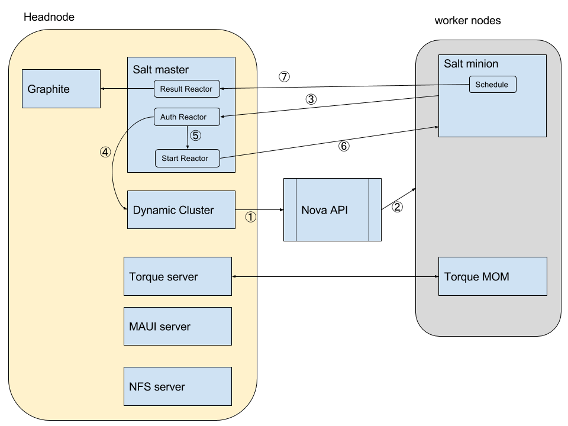

# All in one

For people who are new to Dynamic Cluster and want to get some ideas of how it works, this all-in-one system is perfect with all elements in one host. A heat template file is also provided so one can deploy a working dynamic cluster with several point-and-clicks.

## Installation

The URL of heat template is https://raw.githubusercontent.com/eResearchSA/citc/master/all-in-one/heat.yaml

In OpenStack dashboard, go to *stacks*, and click *Launch Stack*.

In the first dialog, put in the above URL in the template URL box.

In the second dialog, you can change the template's parameters.

* Stack Name: you have to give the stack a name.
* OpenStack Name of the head node: name of the head node
* Instance Type: instance type of the head node
* Key Name: SSH Key name, which you use to ssh to the head node and worker nodes
* Availability Zone: availability zone of the head node, note that you can put head node and worker nodes in different zones
* Image ID: the image to launch the head node, note that it must be a RHEL compatible distro.
* Network range for users: the network range you want to open for ssh (and dynamic cluster dashboard) access

Default values are provided, however *Key Name* and *Network range for users* must be changed according to your environment.

Then click *Launch*, and after about 40 minutes, the instance will be ready for the first-time login.

SSH to the head node and sudo to root.

Open /opt/all-in-one/srv/salt/dynamiccluster/dynamiccluster.yaml, and change OpenStack username, password and project in the config file to be yours. If you want to change other variables, please see [here](http://eresearchsa.github.io/dynamiccluster/deploy.html#configuration) for details.

Then run

	salt-call --local state.sls dynamiccluster
	
to configure Dynamic Cluster, after configuration it will start automatically.

If everything works well, you will be able to go to its dashboard (https://IP/dashboard) using a browser. The default username/password is admin/dcadmin.

The template creates a user called *fred*, which is used to submit jobs. /data is shared via NFS and mounted on all worker nodes, and users must submit jobs from there.

## System Structure

This heat template installs the following components.

Head node:

* Salt master
* Torque server
* Torque client
* MAUI server
* Dynamic Cluster
* NFS server
* Graphite

Worker node:

* Salt minion
* Torque MOM
* NFS client

It also creates a security group and some rules. Access control is achieved by using iptables and ipset because worker nodes are all dynamic.

This system takes advantage of [Salt Stack](http://saltstack.com/community/) to achieve automatic and dynamic worker node configuration. The key feature used is Salt Stack's event system. Salt Stack supports custom event reactors that are triggered on certain events. These reactors can be programmed to deal with events accordingly.

The workflow is depicted in the above diagram.

1. Dynamic Cluster sends a request to Nova API to launch a new instance. This request includes a user-data script that sets up a salt minion in the instance and the minion is assigned a minion ID that includes a random string and is only known to Dynamic Cluster.
2. Nova API launches the instance.
3. User-data scripts starts Salt minion on startup. Salt minion sends an auth request to the master. This will trigger an event, which is captured by auth reactor.
4. Auth reactor checks Dynamic Cluster to verify the requested minion's ID. If the ID is known to Dynamic Cluster and the corresponding instance state in Dynamic Cluster is _starting_, the auth request is legitimate and will be accepted. 
5. This triggers a start event when the minion starts communication with the master.
6. Start rector captures the minion's start event and sends a command (state.highstate) to configure the minion's host. The state of the configuration is checked by Dynamic Cluster periodically and once it is finished, Dynamic Cluster will proceed to the next step.
7. This system also includes a Salt-based mechanism to send the host's stats to master. The sender is a group of collectors that are run by Salt's scheduler. These collectors collect CPU, memory, network, and disk stats periodically and send them to the master as events. These events are captured by a result reactor and this reactor parses these events, extracts data from them and writes data to Graphite.

