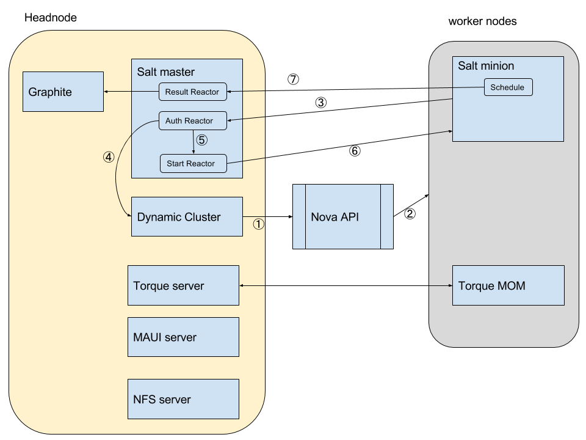

# Basic Setup

The basic setup creates a cluster in the NeCTAR OpenStack cloud with all the key components installed on one host on a cloud virtual machine.

This is recommended for people who are new to Dynamic Cluster and just want a basic system that they can start using.
A Heat template file is also provided so a working dynamic cluster can be easily deployed through a point-and-click interface.

## Installation

The URL of Heat template is https://raw.githubusercontent.com/eResearchSA/citc/master/all-in-one/heat.yaml

This allows the user to easily start up a head node for the cluster.

In OpenStack dashboard, go to *Orchestration* then *Stacks*, and click *Launch Stack*.

In the first dialog, select URL for Template Source and put in the above URL for the Heat template.

In the second dialog, you can change the template's parameters.

* Stack Name: you have to give the stack a name.
* Password for user: TBD explain what this is and what user needs to know - point to Nectar doco
* OpenStack Name of the head node: name of the head node
* Instance Type: instance type of the head node
* Key Name: SSH Key name, which you use to ssh to the head node and worker nodes. TBD - explain that this is Nectar key and point to Nectar doco 
* Availability Zone: availability zone of the head node, note that you can put head node and worker nodes in different zones
* Image ID: the image to launch the head node, note that it must be a RHEL 6 compatible distro. The default image is NeCTAR Scientific Linux 6.5.
* Network range for users: the network range you want to open for ssh (and Dynamic Cluster dashboard) access by cluster users. If you don't know what this is, ask your local IT support staff.

Default values are provided, however *Key Name* and *Network range for users* must be changed according to your environment.

Then click *Launch*, and the system will start up and configure the cluster head node. This may take about 40 minutes. The instance will then be ready for the first-time login. Now you can log in and configure Dynamic Cluster to set up the worker nodes.

SSH to the head node and sudo to root.

Open the config file /opt/all-in-one/srv/salt/dynamiccluster/dynamiccluster.yaml with your favourite text editor, and specify your NeCTAR OpenStack username, password and project. If you want to change other variables, please see [here](http://eresearchsa.github.io/dynamiccluster/deploy.html#configuration) for details.

Then run

	salt-call --local state.sls dynamiccluster
	
to configure Dynamic Cluster, which will then start automatically and launch worker nodes according to the information specified in the configuration file. This will take some time to complete.

If everything works well, you will be able to use a web browser to go to the Dynamic Cluster dashboard at https://IP/dashboard (where IP is the IP address of your cluster head node). The default username/password is admin/dcadmin.

The template creates a user called *fred*, which is used to submit jobs. A directory called /data is created on the instance storage of the head node and shared via NFS and mounted on all worker nodes, and users must submit jobs from there. If you have access to cloud volume storage, you can mount the volume as /data and use that instead.

## System Structure

The Heat template installs the following components.

Head node:

* Salt master
* Torque server
* Torque client
* MAUI server
* Dynamic Cluster
* NFS server
* Graphite

Worker node:

* Salt minion
* Torque MOM
* NFS client

It also creates a security group and some rules. Access control is achieved by using iptables and ipset because worker nodes are all dynamic.

This system takes advantage of [Salt Stack](http://saltstack.com/community/) to achieve automatic and dynamic worker node configuration. The key feature used is Salt Stack's event system. Salt Stack supports custom event reactors that are triggered on certain events. These reactors can be programmed to deal with events accordingly.

The workflow is depicted in the above diagram.

1. Dynamic Cluster sends a request to Nova API to launch a new instance. This request includes a user-data script that sets up a salt minion in the instance and the minion is assigned a minion ID that includes a random string and is only known to Dynamic Cluster.
2. Nova API launches the instance.
3. User-data scripts starts Salt minion on startup. Salt minion sends an auth request to the master. This will trigger an event, which is captured by auth reactor.
4. Auth reactor checks Dynamic Cluster to verify the requested minion's ID. If the ID is known to Dynamic Cluster and the corresponding instance state in Dynamic Cluster is _starting_, the auth request is legitimate and will be accepted. 
5. This triggers a start event when the minion starts communication with the master.
6. Start rector captures the minion's start event and sends a command (state.highstate) to configure the minion's host. The state of the configuration is checked by Dynamic Cluster periodically and once it is finished, Dynamic Cluster will proceed to the next step.
7. This system also includes a Salt-based mechanism to send the host's stats to master. The sender is a group of collectors that are run by Salt's scheduler. These collectors collect CPU, memory, network, and disk stats periodically and send them to the master as events. These events are captured by a result reactor and this reactor parses these events, extracts data from them and writes data to Graphite.

